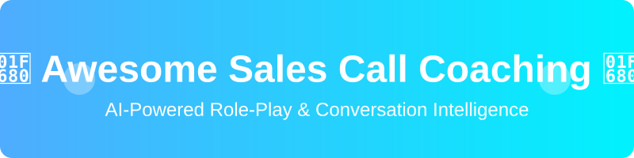

  

  
  
  
  

# 🚀 Awesome Sales Call Coaching

## 🌟 Top Sales Call Coaching Platforms Ecosystem

**Curated List of SaaS Products & Open-Source GitHub Projects** 💼

*Focused on AI Role-Play, Conversation Intelligence, Call Scoring, Objection Handling, Enablement & Real-Time Coaching.* Improve your sales performance, boost win rates, and accelerate rep onboarding with these top-tier sales tools. 📈

**Last updated: August 2026** 📅

This repository tracks notable **SaaS platforms** and **open-source projects** for **Sales Call Coaching**. These tools help sales teams practice realistic buyer conversations, analyze live or recorded calls, score performance against playbooks, deliver targeted coaching, and accelerate ramp and skill development. Perfect for sales enablement leaders, SDRs, and AEs looking to optimize their sales funnel. 🎯

**Examples** include Second Nature, Quantified AI, Mindtickle, Allego, PitchMonster, Hyperbound, SalesHood, Showpad Coach, Lessonly, and LevelJump (the category leaders). 🏆

**Open-source emphasis**: This section is heavily expanded with every major active project for self-hosted call analysis, AI coaching agents, role-play simulators, transcript intelligence, and open conversation-intelligence alternatives — ideal for enablement teams, sales leaders, and developers seeking transparent, privacy-respecting coaching systems. 🔓

Contributions welcome! Open a PR to add/update entries. Keep descriptions factual and link to official sites. 🤝

## 📑 Table of Contents

- [SaaS/Hosted Platforms](#saas-products)
- [Open-Source GitHub Projects](#open-source-github-projects)
- [Star History](#star-history)
- [How to Contribute](#how-to-contribute)
- [Disclaimer](#disclaimer)

## 🏢 SaaS/Hosted Platforms

| Platform | Description | Pricing | Free Tier Limits | Company Size / Valuation |
| :--- | :--- | :--- | :--- | :--- |
| **[Lessonly (Seismic)](https://www.seismic.com/)** | Learning and coaching solution (now part of broader enablement platforms) focused on practice, reinforcement, and skill development. | ~$300/month for small teams | No free trial available (Demo only) | ~$3 Billion |
| **[Mindtickle](https://www.mindtickle.com/)** | Comprehensive sales readiness and enablement suite combining content, coaching, AI role-play, certification, and readiness indexing for enterprise teams. | ~$15-$50/user/month | No free trial available (Demo only) | ~$1.2 Billion |
| **[Showpad Coach](https://www.showpad.com/)** | Coaching and enablement capabilities within the Showpad platform, supporting video practice, content, and field sales readiness. | Quote-based Enterprise Bundles only | Negotiable pilot trial only | ~$1 Billion |
| **[Allego](https://www.allego.com/)** | Sales enablement and coaching platform focused on video-based practice, peer feedback, content management, and mobile learning. | ~$15–$40/user/month (min $15,000/yr) | No free trial available (Demo only) | ~$500 Million |
| **[LevelJump](https://www.leveljump.io/)** | Sales coaching and enablement platform aimed at improving rep performance through structured practice and feedback. | Bundled in Salesforce Sales Cloud | No free trial available (Demo only) | ~$250 Billion (Salesforce) |
| **[SalesHood](https://www.saleshood.com/)** | Sales enablement and coaching platform offering video coaching, training content, and team collaboration features. | Starts at ~$45/user/month (Essential Plan) | 30-day free trial | ~$100 Million+ |
| **[Quantified AI](https://quantified.ai/)** | AI role-play and communication coaching platform, particularly strong for regulated industries, with avatar technology and performance scoring. | ~$85–$110/user/month | No free trial available (Demo only) | ~$15 Million Raised |
| **[Second Nature](https://secondnature.ai/)** | AI-powered sales role-play platform with interactive avatars, multi-language support, structured pitch practice, scoring, and certification workflows. | ~$30-$100/user/month (min $19,000/yr) | Free web-based role-play simulation only | ~$12 Million Raised |
| **[Hyperbound](https://www.hyperbound.ai/)** | AI sales role-play and coaching platform specializing in realistic outbound and discovery practice, with reinforcement loops tied to real performance. | ~$15,000/year | Free demo limited to 9 AI roleplay bots | ~$4.3 Million Raised |
| **[PitchMonster](https://www.pitchmonster.io/)** | AI role-play platform that pairs realistic buyer simulations with post-session Socratic-style AI coaching for skill improvement. | ~$1,200/quarter minimum ($4,800/yr) | No free trial available (Demo only) | Bootstrapped / Early Stage |

*(Table sorted by Company Size / Valuation descending)*

## 💻 Open-Source GitHub Projects

| Repository | Stars | Description |
| :--- | :--- | :--- |
| **[openai/whisper](https://github.com/openai/whisper)** |  | Robust speech recognition via large-scale weak supervision. Excellent for local, high-accuracy call transcription. |
| **[jmorganca/ollama](https://github.com/jmorganca/ollama)** |  | Get up and running with Llama 3, Mistral, Gemma, and other large language models locally. Ideal for private sales coaching intelligence. |
| **[ggerganov/whisper.cpp](https://github.com/ggerganov/whisper.cpp)** |  | High-performance inference of OpenAI's Whisper automatic speech recognition model. Great for real-time sales transcriptions. |
| **[Significant-Gravitas/AutoGPT](https://github.com/Significant-Gravitas/AutoGPT)** |  | An experimental open-source attempt to make GPT-4 fully autonomous. Can be adapted for autonomous AI sales SDRs and coaching agents. |
| **[hwchase17/langchain](https://github.com/hwchase17/langchain)** |  | Framework for developing applications powered by language models. Useful for building custom sales coaching RAG pipelines. |
| **[issacops/opencloser-v2](https://github.com/issacops/opencloser-v2)** |  | Open-source AI sales platform that runs locally and includes an AI Sales Coach for objection sparring, post-call debriefs, sentiment analysis, and practice scenarios. |
| **[syedali11/Sales-Call-Analyzer](https://github.com/syedali11/Sales-Call-Analyzer)** |  | Streamlit app to transcribe and analyze sales calls, extracting action items, objections, and generating coaching feedback. |

*(Table sorted by Star Count descending)*

### 🛠️ Additional Strong Open-Source Options

- 🎙️ Self-hosted transcription + RAG systems for private call analysis.
- 📊 Rubric-based scoring notebooks and Streamlit dashboards for managers.
- 🤖 AI sparring partners built on open LLMs for objection handling practice.
- 🔌 Integration examples that pull call recordings from CRMs or dialers into open analysis pipelines.
- 📝 Prompt libraries and evaluation frameworks for consistent sales coaching feedback.

**Frameworks for building custom systems**: Transcribe calls with open models (Whisper or equivalents), analyze with local or API LLMs using structured prompts or RAG against your playbook, score against custom rubrics, store results in a simple database, and expose coaching insights via Streamlit or internal dashboards. Add role-play loops with LLM-powered buyer personas. Local LLMs keep sensitive call data private while still delivering actionable coaching. 🚀

## 📈 Star History

## 🤝 How to Contribute

1. Fork the repo. 🍴
2. Add/edit entries in `README.md` (follow existing format). ✍️
3. Include: name, link, 1–2 sentence description, and whether it's SaaS or open-source. 🔗
4. Submit PR with a short explanation. ✅

Star the repo if you find it useful! ⭐

## ⚠️ Disclaimer

- This is a **community-curated** list — not exhaustive and not an endorsement.
- Sales call coaching involves sensitive conversation data. Ensure compliance with recording consent laws, privacy regulations (GDPR, CCPA, etc.), and internal policies. Open-source tools require careful security and access control when handling real customer interactions. 🔒
- AI coaching suggestions are assistive; they do not replace skilled human managers or proven sales methodology. 🧠

---

**Made for sales enablement leaders, managers, coaches, and teams that want better practice and more actionable call insights.** 💡

Let's make sales call coaching more open, private, and effective. ✨

*Check out other awesome lists at [https://github.com/ishandutta2007/Awesome-Awesome-Awesome](https://github.com/ishandutta2007/Awesome-Awesome-Awesome).*
